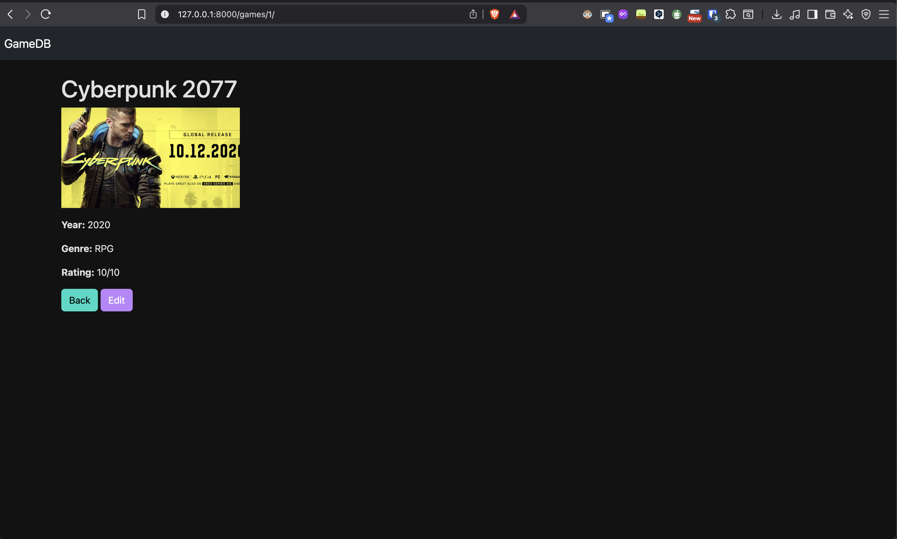
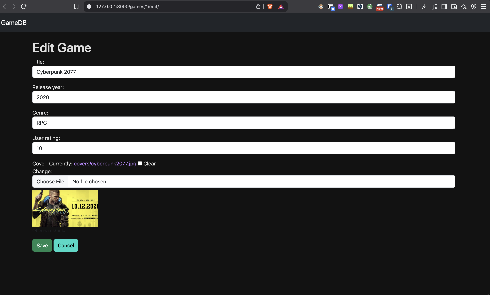

# GameDB - Django Game Collection

GameDB is a simple Django web application to manage a collection of video games.  
It features a dark theme, cover images for games, and a responsive grid layout using Bootstrap 5.

---

## Features

- Add, edit, and delete games (CRUD)
- Upload cover images for games
- Responsive grid layout: 3 columns per row on desktop
- Dark mode theme
- Filter by genre (optional)
- Export / import games to JSON (optional)

---

## Screenshots

<!-- Replace with actual images in your repo -->




---

## Requirements

- Python 3.10+
- Django 4.x+
- Bootstrap 5 (via CDN)
- Optional: Pillow (for image uploads)

---

## Installation & Run Locally

1. Clone the repository:

```bash
git clone https://github.com/YOUR_USERNAME/GameDB.git
cd GameDB
