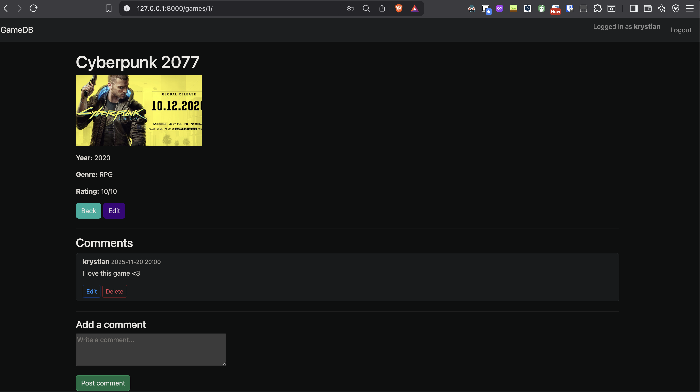
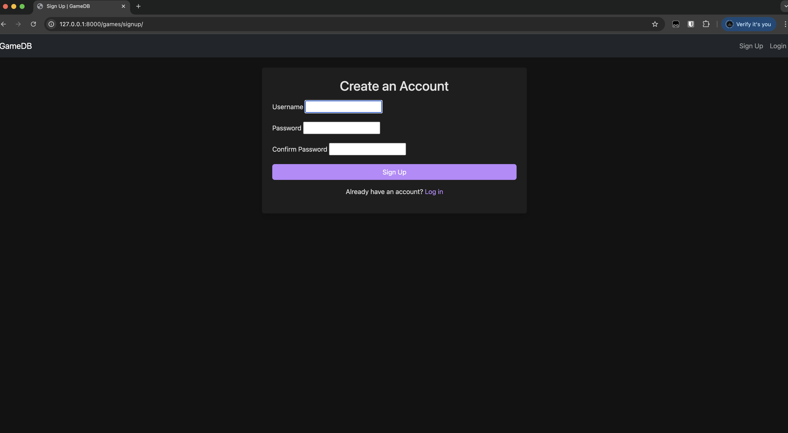

# GameDB - Django Game Collection

GameDB is a simple Django web application to manage a collection of video games.  
It features a dark theme, cover images for games, a responsive Bootstrap layout,  
user authentication, and a built-in comment system for each game.

---

## Features

- Add, edit, and delete games (CRUD)
- Upload cover images for games
- Responsive grid layout (Bootstrap 5)
- Dark mode theme
- User registration, login, and authentication
- Game owners can edit/delete only their own games
- **💬 Comment system**
  - Users can post comments under each game  
  - Comments include author & timestamp  
  - Users can edit/delete their own comments  
  - Admin/staff and game owners can delete any comment  
- Optional: Filter by genre
- Optional: Export / import games to JSON

---

## Screenshots

<!-- Replace with actual images in your repo -->





---

## Requirements

- Python 3.10+
- Django 4.x+
- Pillow (for image uploads)
- Bootstrap 5 (via CDN)

---

## Installation & Run Locally

1. Clone the repository:

```bash
git clone https://github.com/YOUR_USERNAME/GameDB.git
cd GameDB
